**Founding engineer who works the whole stack,** from systolic arrays and interconnect cost models 
up to voice apps people talk to while they wait in a Seattle ramen line.

 

## The stack, with receipts

Most engineers pick a layer. I follow the bug wherever it goes.

<table>
<tr><th align="left">Layer</th><th align="left">What I built or broke open</th><th align="left">Proof</th></tr>

<tr><td><b>L5 · Product</b></td><td>
Founding engineer on <b>Aura</b>, a voice-first AI companion that remembers you, reaches out first, and runs your calendar and email.
Also shipped <b>Depth-wise</b> (questions become knowledge trees), <b>Pocket-Panel</b> (two Nova Sonic voice agents arguing live over websockets) and <b>MedTriageAI</b> (call a phone number, get triaged).
</td><td><a href="https://auravoiceapp.com">auravoiceapp.com</a> <a href="https://depthwise.app">depthwise.app</a> <a href="https://pocketpanel-production.up.railway.app">Pocket-Panel</a></td></tr>

<tr><td><b>L4 · Devices</b></td><td>
<b>Aura Desktop</b> (Tauri): fully on-device hold-to-talk dictation, OS-level hotkeys, voice control of apps and media keys, macOS at-rest encryption.
A custom <b>Android keyboard</b> that puts the assistant inside every app.
<b>Ooink AI</b>: an animated voice pig on a tablet kiosk outside Ooink Ramen, Seattle, answering menu questions from people in line.
</td><td><a href="https://github.com/AuraVoice/Aura-Desktop/pulls?q=is%3Apr+author%3Avaruntej07+is%3Amerged">25 merged PRs</a> <a href="https://github.com/varuntej07/ooink-ai">ooink-ai</a></td></tr>

<tr><td><b>L3 · Cloud runtime</b></td><td>
Aura's backend: FastAPI on Cloud Run, a separately deployed LiveKit voice worker so a slow call never blocks the request path, Cloud Tasks with idempotent claims,
and a failover contract across Anthropic, Gemini and OpenAI, with per-stage STT, LLM and TTS fallbacks.
</td><td><a href="https://github.com/varuntej07/Aura">Aura</a></td></tr>

<tr><td><b>L2 · Inference</b></td><td>
Compiled CLIP to a static NEFF on <b>Inferentia2</b> and read the hardware trace: <b>17.9x to 66x</b> faster than CPU at ~1e-5 logit drift.
Profiled Qwen2.5-VL-7B on a T4 and showed that quantizing the vision encoder is free; the 12.4 GB decoder is the only constraint that matters.
</td><td><a href="https://github.com/varuntej07/clip-neuron-profiling">clip-neuron-profiling</a> <a href="https://github.com/varuntej07/vlm-inference-profiler">vlm-inference-profiler</a></td></tr>

<tr><td><b>L1 · Compiler + fabric</b></td><td>
Root-caused a silent <code>torch_neuronx.trace</code> miscompile: a <code>[T, C]</code> buffer read as if laid out <code>[C, T]</code>, the exact pattern in every Whisper-family encoder.
The fix took the Voxtral encoder from cosine <b>0.372 to 0.99873</b>.
Built an alpha-beta cost model for Trainium collectives: a hierarchical ring cuts <b>254</b> EFA-gated steps to <b>14</b> at 128 ranks.
</td><td><a href="https://github.com/aws-neuron/aws-neuron-sdk/issues/1403">aws-neuron-sdk#1403</a> <a href="https://github.com/varuntej07/trainium-collectives">trainium-collectives</a></td></tr>

<tr><td><b>L0 · Silicon</b></td><td>
Wrote flash-decoding attention kernels in <b>NKI</b> (GQA, online softmax carried across KV tiles), merged into AWS's official samples.
Then found all six community kernels broken on SDK 2.32, four of them <b>silently returning zeros</b>, and ported mine to NKI 0.6.0 and validated it on Inf2.
</td><td><a href="https://github.com/aws-neuron/nki-samples/pull/129">nki-samples#129</a> merged <a href="https://github.com/aws-neuron/nki-samples/issues/134">#134</a> · <a href="https://github.com/aws-neuron/nki-samples/pull/133">#133</a></td></tr>
</table>

## On the bench right now

**[voxtral-neuron-router](https://github.com/varuntej07/voxtral-neuron-router)**: fine-tune Voxtral Mini 3B on Trainium, serve it on Inferentia2, and turn raw speech straight into one of Aura's 34 tool calls.
The dataset is done (5,568 clips, 6.6 hours). The encoder compiles and runs at 82 ms on Inf2, but I don't quote that number until its output matches the CPU reference. That hunt is what turned up #1403.

## Bugs I chased into other people's code

- **AWS Neuron:** a silent compiler miscompile ([#1403](https://github.com/aws-neuron/aws-neuron-sdk/issues/1403)) and six broken sample kernels ([#134](https://github.com/aws-neuron/nki-samples/issues/134))
- **Graphify:** Windows hook paths stripped by Git Bash ([#1987](https://github.com/Graphify-Labs/graphify/issues/1987)), a search guard that never fired on Grep ([#1986](https://github.com/Graphify-Labs/graphify/issues/1986)), and a CLI crash on closed pipes ([#1807](https://github.com/Graphify-Labs/graphify/issues/1807)), two of them sent with a fix PR
- **Claude Code:** IDE detection reporting VS Code inside Android Studio ([#42900](https://github.com/anthropics/claude-code/issues/42900))

## Writing

[Triton Is Not CUDA in Python: It's a Tiling DSL](https://medium.com/@varuntej07/triton-is-not-cuda-in-python-its-a-tiling-dsl-c65c15ce3c46) · [Why PyTorch Wastes Your GPU Memory on Purpose](https://medium.com/@varuntej07/why-pytorch-wastes-your-gpu-memory-on-purpose-and-why-thats-brilliant-0a76899797fb)

---

## stats

